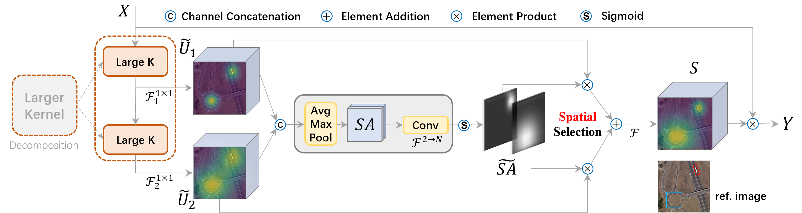

[](https://paperswithcode.com/sota/object-detection-in-aerial-images-on-dota-1?p=large-selective-kernel-network-for-remote)
[](https://paperswithcode.com/sota/object-detection-in-aerial-images-on-hrsc2016?p=large-selective-kernel-network-for-remote)

## This repository is the official implementation of "Large Selective Kernel Network for Remote Sensing Object Detection" at: [https://arxiv.org/pdf/2303.09030.pdf](https://arxiv.org/pdf/2303.09030.pdf)

## Abstract


Recent research on remote sensing object detection has largely focused on improving the representation of oriented bounding boxes but has overlooked the unique prior knowledge presented in remote sensing scenarios. Such prior knowledge can be useful because tiny remote sensing objects may be mistakenly detected without referencing a sufficiently long-range context, and the long-range context required by different types of objects can vary. In this paper, we take these priors into account and propose the Large Selective Kernel Network (LSKNet). LSKNet can dynamically adjust its large spatial receptive field to better model the ranging context of various objects in remote sensing scenarios. To the best of our knowledge, this is the first time that large and selective kernel mechanisms have been explored in the field of remote sensing object detection. Without bells and whistles, LSKNet sets new state-of-the-art scores on standard benchmarks, i.e., HRSC2016 (98.46% mAP), DOTA-v1.0 (81.85% mAP) and FAIR1M-v1.0 (47.87% mAP). Based on a similar technique, we rank 2nd place in 2022 the Greater Bay Area International Algorithm Competition

## Introduction

This repository is the official implementation of "Large Selective Kernel Network for Remote Sensing Object Detection" at: [https://arxiv.org/pdf/2303.09030.pdf](https://arxiv.org/pdf/2303.09030.pdf)

The master branch is built on MMRotate which works with **PyTorch 1.6+**.

LSKNet backbone code is placed under mmrotate/models/backbones/, and the train/test configure files are placed under configs/lsknet/ 


## Results and models

Imagenet 300-epoch pre-trained LSKNet-T backbone: [Download](https://download.openmmlab.com/mmrotate/v1.0/lsknet/backbones/lsk_t_backbone-2ef8a593.pth)

Imagenet 300-epoch pre-trained LSKNet-S backbone: [Download](https://download.openmmlab.com/mmrotate/v1.0/lsknet/backbones/lsk_s_backbone-e9d2e551.pth)

DOTA1.0

|                           Model                            |  mAP  | Angle | lr schd | Batch Size |                                   Configs                                    |                                                               Download                                                               |     note     |
| :--------------------------------------------------------: | :---: | :---: | :-----: | :--------: | :--------------------------------------------------------------------------: | :----------------------------------------------------------------------------------------------------------------------------------: | :----------: |
| [RTMDet-l](https://arxiv.org/abs/2212.07784) (1024,1024,-) | 81.33 |   -   | 3x-ema  |     8      |                                      -                                       |                                                                  -                                                                   |  Prev. Best  |
|                  LSKNet_T (1024,1024,200)                  | 81.37 | le90  |   1x    |    2\*8    |     [lsk_t_fpn_1x_dota_le90](./configs/lsknet/lsk_t_fpn_1x_dota_le90.py)     | [model](https://download.openmmlab.com/mmrotate/v1.0/lsknet/lsk_t_fpn_1x_dota_le90/lsk_t_fpn_1x_dota_le90_20230206-3ccee254.pth) \| [log](https://download.openmmlab.com/mmrotate/v1.0/lsknet/lsk_t_fpn_1x_dota_le90/lsk_t_fpn_1x_dota_le90_20230206.log) |              |
|                  LSKNet_S (1024,1024,200)                  | 81.64 | le90  |   1x    |    1\*8    |   [lsk_s_fpn_1x_dota_le90](./configs/lsknet/lsk_s_fpn_1x_dota_le90.py)    | [model](https://download.openmmlab.com/mmrotate/v1.0/lsknet/lsk_s_fpn_1x_dota_le90/lsk_s_fpn_1x_dota_le90_20230116-99749191.pth) \| [log](https://download.openmmlab.com/mmrotate/v1.0/lsknet/lsk_s_fpn_1x_dota_le90/lsk_s_fpn_1x_dota_le90_20230116.log) |              |
|                 LSKNet_S\* (1024,1024,200)                 | 81.85 | le90  |   1x    |    1\*8    | [lsk_s_ema_fpn_1x_dota_le90](./configs/lsknet/lsk_s_ema_fpn_1x_dota_le90.py) | [model](https://download.openmmlab.com/mmrotate/v1.0/lsknet/lsk_s_ema_fpn_1x_dota_le90/lsk_s_ema_fpn_1x_dota_le90_20230212-30ed4041.pth) \| [log](https://download.openmmlab.com/mmrotate/v1.0/lsknet/lsk_s_ema_fpn_1x_dota_le90/lsk_s_ema_fpn_1x_dota_le90_20230212.log) | EMA Finetune |

FAIR1M-1.0

|         Model         |  mAP  | Angle | lr schd | Batch Size |                                                    Configs                                                     |                                                                                                                                                                              Download     | note                                                                                                                                                                         |
| :----------------------: | :---: | :---: | :-----: | :------: | :------------------------------------------------------------------------------------------------------------: | :----------------------------------------------------------------------------------------------------------------------------------------------------------------------------------------------------------------------------------------------------------------------------------------------------------------------------------------------------------------: | :--------: |
| [O-RCNN](https://arxiv.org/abs/2108.05699) (1024,1024,200) | 45.60 | le90  |   1x    |    1*8     |  [oriented_rcnn_r50_fpn_1x_fair_le90](./configs/oriented_rcnn/oriented_rcnn_r50_fpn_1x_fair_le90.py)  |      -   | Prev. Best |
| LSKNet_S (1024,1024,200) | 47.87 | le90  |   1x    |    1*8     |            [lsk_s_fpn_1x_dota_le90](./configs/lsknet/lsk_s_fpn_1x_dota_le90.py)             |         [model](https://pan.baidu.com/s/1sXyi23PhVwpuMRRdwsIJlQ?pwd=izs8) \| [log](https://pan.baidu.com/s/1idHq3--oyaWK3GWYqd8brQ?pwd=zznm)         | |

HRSC2016 

|                    Model                     | mAP(07) | mAP(12) | Angle | lr schd | Batch Size |                                      Configs                                      |                                                               Download                                                               |    note    |
| :------------------------------------------: | :-----: | :-----: | :---: | :-----: | :--------: | :-------------------------------------------------------------------------------: | :----------------------------------------------------------------------------------------------------------------------------------: | :--------: |
| [RTMDet-l](https://arxiv.org/abs/2212.07784) |  90.60  |  97.10  | le90  |   3x    |     -      |                                         -                                         |                                                                  -                                                                   | Prev. Best |
|  [ReDet](https://arxiv.org/abs/2103.07733)   |  90.46  |  97.63  | le90  |   3x    |    2\*4    | [redet_re50_refpn_3x_hrsc_le90](./configs/redet/redet_re50_refpn_3x_hrsc_le90.py) |                                                                  -                                                                   | Prev. Best |
|                   LSKNet_S                   |  90.65  |  98.46  | le90  |   3x    |    1\*8    |       [lsk_s_fpn_3x_hrsc_le90](./configs/lsknet/lsk_s_fpn_3x_hrsc_le90.py)        | [model](https://download.openmmlab.com/mmrotate/v1.0/lsknet/lsk_s_fpn_3x_hrsc_le90/lsk_s_fpn_3x_hrsc_le90_20230205-4a4a39ce.pth) \| [log](https://download.openmmlab.com/mmrotate/v1.0/lsknet/lsk_s_fpn_3x_hrsc_le90/lsk_s_fpn_3x_hrsc_le90_20230205-4a4a39ce.pth) |            |

## Installation

MMRotate depends on [PyTorch](https://pytorch.org/), [MMCV](https://github.com/open-mmlab/mmcv) and [MMDetection](https://github.com/open-mmlab/mmdetection).
Below are quick steps for installation.
Please refer to [Install Guide](https://mmrotate.readthedocs.io/en/latest/install.html) for more detailed instruction.

```shell
conda create --name openmmlab python=3.8 -y
conda activate openmmlab
conda install pytorch==1.8.0 torchvision==0.9.0 cudatoolkit=10.2 -c pytorch
pip install -U openmim
mim install mmcv-full
mim install mmdet
git clone https://github.com/zcablii/Large-Selective-Kernel-Network.git
cd Large-Selective-Kernel-Network
pip install -v -e .
```

## Get Started

Please see [get_started.md](docs/en/get_started.md) for the basic usage of MMRotate.
We provide [colab tutorial](demo/MMRotate_Tutorial.ipynb), and other tutorials for:

- [learn the basics](docs/en/intro.md)
- [learn the config](docs/en/tutorials/customize_config.md)
- [customize dataset](docs/en/tutorials/customize_dataset.md)
- [customize model](docs/en/tutorials/customize_models.md)
- [useful tools](docs/en/tutorials/useful_tools.md)


## Acknowledgement

MMRotate is an open source project that is contributed by researchers and engineers from various colleges and companies. We appreciate all the contributors who implement their methods or add new features, as well as users who give valuable feedbacks. We wish that the toolbox and benchmark could serve the growing research community by providing a flexible toolkit to reimplement existing methods and develop their own new methods.

## Citation

If you use this toolbox or benchmark in your research, please cite this project.

```bibtex
@article{li2023large,
  title   = {Large Selective Kernel Network for Remote Sensing Object Detection},
  author  = {Li, Yuxuan and Hou, Qibin and Zheng, Zhaohui and Cheng, Mingming and Yang, Jian and Li, Xiang},
  journal={ArXiv},
  year={2023}
}
```

## License

This project is released under the [Apache 2.0 license](LICENSE).
